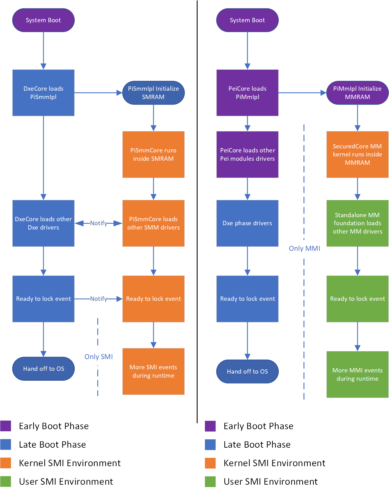
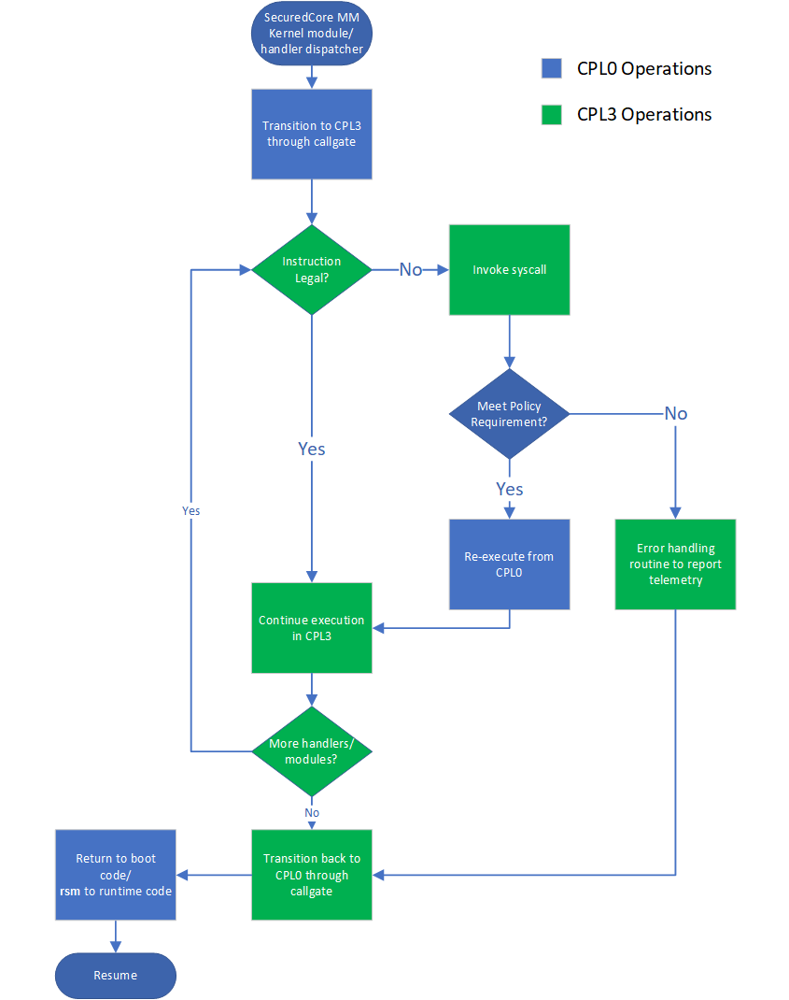

# Microsoft MM Supervisor Overview

## Overview

The Microsoft MM Supervisor implements a SMM isolation solution that meets the
[Secured-core PC requirements](https://learn.microsoft.com/windows-hardware/design/device-experiences/oem-highly-secure-11).

The MM Supervisor combines the latest best practices for SMM safety including:

* A customizable security policy that can be tailored to the platform
* Early boot (PEI) launch capability
* Privilege separation between supervisor and user mode
* Stringent memory isolation

Key features of the MM Supervisor include:

* The MM foundation is initialized early in the boot process and has isolated protocol and configuration table database
* The MM supervisor holds separate service databases for supervisor and user mode services
* Platform MM drivers and handlers execute under user mode (CPL3)
* It follows a binary release model

The solution is open source and available in this repository.

---

## Problems with Traditional MM Today With No Supervisor

* Late loading in the boot phase, so that other malicious DXE code may interfere with MM environment construction.
* Excessive interaction with boot code, which entangles interactions with DXE core, exposing additional attack surface.
* All MMI handlers run under kernel mode, thus highly privileged code execution within MM is shared across all code
  instead of just the necessary "core" code.

🗒️More details about Traditional MM are included in [Traditional MM Framework Implementation for Reference](TraditionalMm.md).

## Standalone MM Hob (PEIM) Creates Necessary Hobs Serving as Placeholder

1. `EfiSystemTable`
1. MM Core private data
1. ACPI communication buffer address
1. TCG NVS address from TPM ACPI table
1. Memory Map for DXE environment

## DXE MM IPL Entry Point

The IPL performs the following tasks:

1. Populates Hobs 1 and 2 Prior to loadiing the MM Supervisor
    * Memory Map as of now is still populated only in ready to lock
    * Hobs 3 and 4 are populated in their separate drivers during their loading
    * TODO: the ideal process would be all these hob population can be moved to null library and IPL can stay out of it
1. Finds the largest available MMRAM region and copies the MM Supervisor to this region to load it
1. After MM Supervisor loading, close SMRAM to prevent SMRAM access
1. Before publishing the Supervisor communication protocol, the IPL tests communication to Supervisor to query Supervisor
   version and verify the returned version and patch level is non-zero AND meets other system requirements. Known
   limitations for GCC toolchain:
    * **Patch level information, which should be embedded into image version of built PE/COFF header cannot be integrated
    when using GCC toolchain. User builds with GCC tools are welcome to reach out to `MsCoreUefi@microsoft.com` for
    technical discussion in that regards.**
    * **The driver version embedded into the subsystem version of PE/COFF header is being parsed by objcopy when using GCC
    toolchain. This tool would parse input numeric strings with implicit base (i.e. strings beginning with `0`s will be
    parsed as octal numbers). However, the MSFT linker specifically only parses it as decimal numbers.**
1. Publishes the protocol to be used by DXE drivers for ring 3 brokage interaction
1. Sends brokage commands to the MM Supervisor to load the rest of MM drivers (this is done so that all drivers can be
   transitioned to CPL3 under MM environment instead of DXE environment)

## Core Responsibilities of the MM Supervisor

1. Provide memory service
1. Provide protocol publication and notification
1. Provide MMI handler register and unregister
1. Provide `gMmst` table for usage
1. Relocate MMI entry for x64 architecture
1. Setup GDT, IDT, exception handlers for MMI environment
1. Setup stack for each CPU in MMI environment
1. Setup DXE to MM Supervisor brokage pipeline
    * This will be a MM Supervisor registered handler that run under CPL0 for DXE to demand special commands from MM
      Supervisor (i.e. dispatch MM drivers, query version or configuration information, fetch isolation policy)
    * This will be provided as DXE_DRIVER type library API for consumption
1. Mark supervisor pages that correspond to data consumed by MM Supervisor as well as Supervisor code and lock MM control
registers if applicable
1. Return to DXE

## MM Foundational Isolation

1. Page table:
    * Once MM foundation sets up MMI environment, the foundation data and code needs to be marked as supervisor pages.
    * More data allocated internally will also be marked as supervisor pages.
    * Memory services from subsequent drivers will be marked as user pages.
    * At ready to lock event, ring 0 GDT and IDT and page table itself will be patched to read only.
1. Privilege level:
    * MM foundation will execute at CPL0 to access all data and code if allowed by page table.
    * Before loading MM drivers, core will update stack pointer in TSS and return address from call gate. Return far with
      target `SS:RSP` and `CS:RIP`.
    * After MM driver returns, call far will return to the original return address from call gate set up.
    * For MMI. Before dispatching each MMI handlers, if prior to ready to lock, core will update stack pointer in TSS and
      return address from call gate. Return far with target `SS:RSP` and `CS:RIP`. *Note: this will need to be in `APHandler`
      for APs and around MMI handler dispatching for BSP*.
    * After MMI returns, call far will return to the original return address from call gate set up.

1. The syscall interface is used (see the flow chart) to elevate privilege to execute necessary services under CPL0
   from CPL3:
    * Core services provided through `gMmst` provided under CPL3 will be a syscall shim, it implements most `gMmst` service
      by invoking syscall and have core service replay the request.
    * Certain privileged instructions such as IO read/write, MSR read/write, and INT, WBI, HLT will be evaluated through
      policy gate before proceeding.
    * Telemetry records: when prohibited syscall occurs, core service will jump to preset variable service in Ring 3,
      write NV variable and long jump back to the point where Ring 3 is enforced.

## Individual MMI Input Flow

1. At the MMI entry point, each core will setup their MSR of STARs to point to core syscall center in MM core. And
   restore MSR back before `rsm` from the MMI.
1. Each core will still go through the `SmiRendezvous` flow. BSP will go all the way to MMI handler dispatcher and transition
   to Ring 3, then run the handler code in Ring 3. And then come back to Ring 0 upon returning.
1. AP will wait at idle state, till notified that there are schedules in the queue. Before loading the function pointers,
   AP will transition to Ring 3 and then execute procedures in Ring 3. And then come back to Ring 0 upon returning.
1. Prior to dispatching individual MMI handlers, MM supervisor will copy incoming communicate buffers into MMRAM region,
   marked with proper memory attributes (user vs. kernel). The copied buffers will be dispatched to MMI handlers.
1. Note that when ring level changes, the stack switch will occur as well. Thus when setting up stack, the Ring 3 stack
   needs to be allocated separately.

## MM Core <-> Driver Interface

1. Between MM drivers and MM Supervisor, a shim driver will be loaded first to publish a shim `gMmst`, which will implement
   some of the real `gMmst` function through syscall request.
    * This driver will also manage protocol data base in Ring 3, meaning the entire protocol publication, notification,
      location will be under Ring 3 and application level. And there will be no protocol published from MM core.
    * The driver will also need to refresh the content of table when there is potential to change the values in the table
      (number of configuration table entries, etc).
1. Also between MM drivers and MM Supervisor, syscall version of `BaseLib`, `CpuLib` and `IoLib` for MM EFI drivers.
   This will provide a direct interface to request privileged information from MM core.
1. Between DXE drivers and MM Supervisor, a brokage pipeline (special MM handler) will be set up for information querying
   and driver dispatching.

## PEI MM Launch

1. At the entrypoint of MM PEI IPL, the PEIM will go over system prerequisites to make sure MM foundation is ready to
   instantiate. These requirements include establishing designated MM communication buffers for both user and supervisor,
   MM control PPI to trigger MMI, MM access PPI to coalesce all available MMRAM regions and lock/close them once MM foundation
   is set.
1. MM PEI IPL will iterate through all available MMRAMs and load the located MM core (supervisor in this case) into MMRAM.
1. If the system operates PEI in 32-bit mode where as MM foundation needs to run in X64, MM PEI IPL will load a MM IPL X64
   relay module, which runs similar to the CapsuleX64.inf from `MdeModulePkg`. MM PEI IPL will cache system context then
   switch the operation mode to X64 to execute X64 relay module.
    * Note: Although the X64 relay module is a PEIM module in UEFI environment, but it does not have PEI services like
      other PEIMs
    * The MM core is loaded and relocated in normal PEI environment. The X64 relay routine will only execute the core
      entrypoint with supplied hob start pointer.
1. After the MM core foundation is setup, the system will, fist return to 32-bit mode with cached context information if
   applicable, close and lock all available MMRAM regions.
1. MM PEI IPL initiate test communication to Supervisor by querying Supervisor version before proceeding.
1. MM PEI IPL then install MM communicate and MM supervisor communicate PPIs for usage in the rest of PEI phase.
1. Once the DXE environment is launched, a MM DXE IPL that depends on MM control protocol will test communication to MM
   supervisor by querying supervisor version.
    * Entities that publish MM control protocol might need to avoid double-initialization
1. Once test communication is successful, MM DXE IPL will publish MM communicate and MM supervisor communicate protocols
   for further usage in UEFI DXE or runtime.

## Additional Resources

* Project MU Repositories: <https://github.com/topics/projectmu>
* Standalone MM Specification: Vol. 4:
  Management Mode Core Interface, [UEFI Platform Initialization (PI) Specification 1.7 A](https://uefi.org/sites/default/files/resources/PI_Spec_1_7_A_final_May1.pdf)
* MU Q35 Platform That Uses the MM Supervisor: <https://github.com/microsoft/mu_tiano_platforms>
* QEMU Instructions: <https://github.com/tianocore/edk2/blob/master/OvmfPkg/PlatformCI/ReadMe.md>
