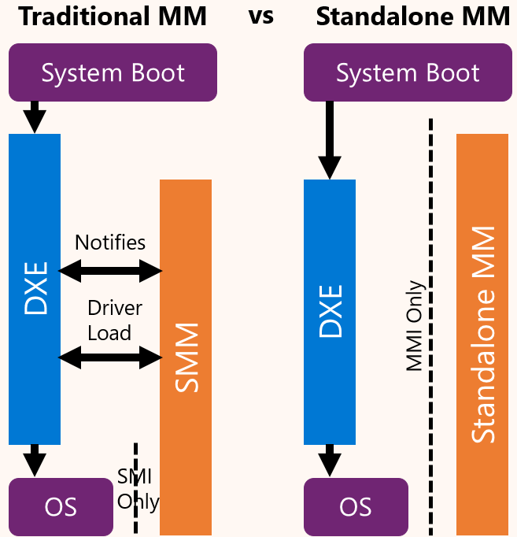
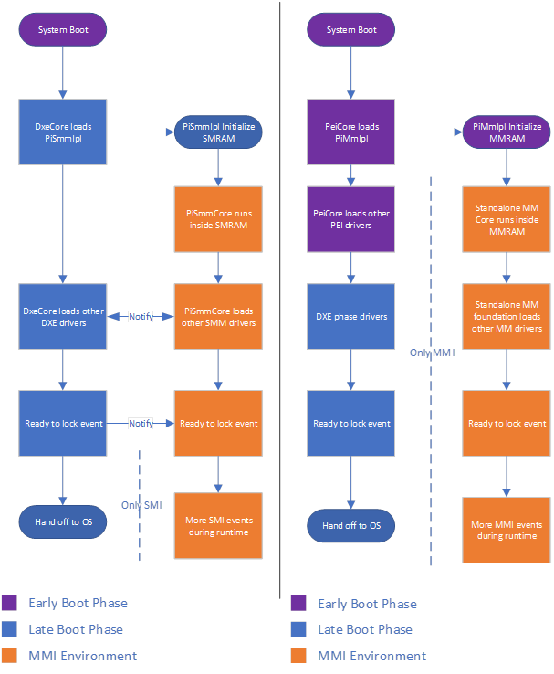
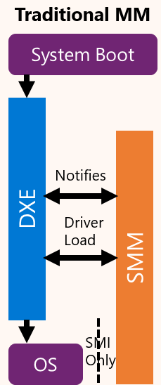

# Traditional MM and Standalone MM

Two common software models for MM code in the industry today that are defined in the
[Platform Initialization (PI) specification](https://uefi.org/specifications) maintained by the UEFI Forum.

- [Standalone MM Spec Details](https://uefi.org/specs/PI/1.8/V4_Overview.html#initializing-management-mode-in-mm-standalonemode)
- [Traditional MM Spec Details](https://uefi.org/specs/PI/1.8/V4_Overview.html#initializing-management-mode-in-mm-traditional-mode)

Separate documents exist to describe the Traditional MM and Standalone MM models in more detail. This document provides
a high-level overview of the two models and contrasts them to help the reader understand the differences between the two
models and the steps to port Traditional MM code to Standalone MM.

- [Standalone MM](StandaloneMm.md)
- [Traditional MM](TraditionalMm.md)

---

It is important to understand that the distinction between these models is purely in software. Any system that supports
Traditional MM can also support Standalone MM. Both modes use the same underlying hardware capabilities. Further,
nearly all existing SMM code can be reused in Standalone MM with no change. Most mandatory changes either involve
minimally changing small portions of code such as an entry point function signature or the module type or making
changes that are not allowed in Standalone MM because they were violating well established security practices in
Traditional MM. For example, compare the “MM Traditional Driver Runtime” section of the PI Specification with the
“MM Standalone Driver Runtime” section.

For additional background on Management Mode (MM), review the Platform Initialization (PI) specifications. In
particular, `Volume 4: Management Mode Core Interface`. As noted in the PI specification, MM is a generic term used to
describe a secure execution environment provided by the CPU and related silicon that is entered when the CPU detects a
Management Mode Interrupt (MMI). x86 systems implement MM with System Management Mode (SMM) and ARM systems do so with
TrustZone (TZ). This document exclusively focuses on the x86 architecture at this time.

This document provides a high-level overview of the Traditional MM and Standalone MM software models within the scope
of details relevant to understand and adopt the solutions in this repository. In the process, it contrasts Traditional
MM with Standalone MM and provides a cursory set the steps to port Traditional MM code in a given platform firmware
to Standalone MM so the platform can use the MM Supervisor as its Standalone MM core.

## High-Level Comparison of Traditional MM and Standalone MM

Traditional MM typically launched in DXE and the DXE and Traditional MM environments closely interacted throughout
driver dispatch. During MM dispatch, drivers execute in two phases – (1) **initialization** and (2) **runtime**.

| | Traditional MM Initialization | Standalone MM Initialization |
|-|-|-|
| Starts | When the driver is loaded into MMRAM and the driver’s entry point is called | When the driver is loaded into MMRAM and the driver’s entry point is called |
| Ends | The driver’s entry point returns | The driver’s entry point returns |
| Protocol Access | **UEFI**  - Boot services - DXE services - Runtime services - DXE protocols  **MM** - MM Services - MM protocols  Note: The PI specification states drivers should not call Exit() or ExitBootServices() during the initialization phase | **MM** - MM Services - MM protocols   Note: Drivers do not have access to interfaces outside the MM environment. |

| | Traditional MM Runtime | Standalone MM Runtime |
|-|-|-|
| Starts | After the initialization phase ends | After the initialization phase ends |
| Protocol Access | **MM** - MM Services - MM protocols  Note: The PI specification states drivers should not call UEFI interfaces and services which were located during the initialization phase. | **MM** - MM Services - MM protocols  Note: Drivers do not have access to interfaces outside the MM environment. |

Given the initialization phase in Traditional MM occurred in DXE, in addition to the `DXE_SMM_DRIVER` driver type,
`EFI_FV_FILETYPE_COMBINED_MM_DXE` driver types are also supported. Combination MM/DXE drivers are especially problematic
for writing portable and secure code. They are launched twice, once by the DXE dispatcher as a normal DXE driver (outside
MMRAM) that uses the `EFI_SECTION_DXE_DEPEX` section and again in Traditional MM (in MMRAM) where the `EFI_SECTION_MM_DEPEX`
is used. In contrast, `MM_STANDALONE` drivers are launched once is Standalone MM only with access to the MM services and
protocols.

## Traditional MM and Standalone MM Dispatch Overview

Because the Standalone MM environment inherently has less coupling with DXE, it is much easier to launch Standalone MM
code earlier in the boot flow which contributes to reducing the overall TCB. In addition, MM drivers cannot depend on
implementation specific DXE protocols and interfaces increasing their portability. For example, this can force MM code
design to be more reusable across silicon generations and client and server codebases.

## The Problems with Traditional MM

Some key issues with Traditional MM are noted below.

1. **Late launch** – Launching in DXE means another execution environment must be trusted after PEI to establish the MM environment.
2. **Excessive DXE coupling** – Traditional MM is architecturally dependent on DXE.
    - MM driver writers often make mistakes and cache interface pointers not allowed in the initialization phase. This is
    a frequent source of security issues.
    - MM drivers are dependent on DXE interfaces in their initialization phase. This makes it more difficult to execute
    these drivers in an environment where DXE is not present.
    - Similar to how MM drivers have dependencies on the load order of the DXE environment, DXE drivers depend on MM drivers.
        - For example, many DXE drivers have a dependency on the UEFI variable architectural protocol and/or the UEFI variable
        write architectural protocol. When MM is launched earlier in boot, such as PEI, the MM environment is already set
        up and ready making DXE dispatch more reliable.
3. **Delayed MM locking** – Some system locks are delayed longer than necessary because the MM initialization phase is open
throughout all of DXE.
4. **Broad memory access** – Traditionally, SMM can access any memory buffer allocated prior to SmmReadyToLock. This presents
security issues in which a freed buffer can be reassigned after the lock event and much more memory is exposed than necessary.
    - It is recommended to use Standalone MM in combination with explicit memory ranges to be unblocked for MM access.
    The [MmUnblockMemoryLib](https://github.com/tianocore/edk2/blob/master/MdePkg/Include/Library/MmUnblockMemoryLib.h)
    API provides a mechanism for callers outside MM to permit explicit ranges to be accessible. Generaly, comm buffers
    are the only memory region outside MMRAM that should be available to MM code.

Launching the MM Foundation earlier brings other benefits such as the ability to use the read/write variable service in
MM while in PEI. Because DXE is not involved, the MM Foundation can be entirely loaded and operational before launching
payloads after PEI other than DXE.

Excessive DXE coupling is an issue because in comparison to other (modern OS) system software, DXE lacks fundamental
protections and DXE vendor code is of unknown quality sometimes delivered in binary form for final platform firmware
integration. The highest privilege envrionment (SMM) on the system should **not** depend upon and be susceptible to DXE
callouts and attacks.

Documents with examples of real-world vulnerabilities due to the Traditional MM model:

- [Finding SMM Privilege-Escalation Vulnerabilities in UEFI Firmware with Protocol-Centric Static Analysis](https://ieeexplore.ieee.org/document/9833723)
- [Through the SMM-class and a vulnerability found there.](https://www.synacktiv.com/en/publications/through-the-smm-class-and-a-vulnerability-found-there.html)
- [Zen and the Art of SMM Bug Hunting | Finding, Mitigating and Detecting UEFI Vulnerabilities](https://www.sentinelone.com/labs/zen-and-the-art-of-smm-bug-hunting-finding-mitigating-and-detecting-uefi-vulnerabilities/)

## Supporting Both Traditional MM and Standalone MM with the Same Source Code

All Traditional MM modules can continue to be supported with most of the code shared between the Traditional MM and
Standalone MM instances.

Typically, modules end up in the following state:

- A Traditional MM INF file
- A Standalone MM INF file
- A Common MM C file – where the actual module implementation is written
- A Traditional MM C file – usually with just the Traditional MM entry point function that calls into the common C code
- A Standalone MM C file – usually with just the Standalone MM entry point function that calls into the common C code

Therefore, the Traditional MM module is not lost, and its implementation can simultaneously stay current with the Standalone
MM driver.

Even for a driver as complex as the UEFI variable driver, this pattern reveals the small touch necessary to support
Standalone MM:

- INF files
  - Traditional MM: [edk2/VariableSmm.inf at master · tianocore/edk2 (github.com)](https://github.com/tianocore/edk2/blob/master/MdeModulePkg/Universal/Variable/RuntimeDxe/VariableSmm.inf)
  - Standalone MM: [edk2/VariableStandaloneMm.inf at master · tianocore/edk2 (github.com)](https://github.com/tianocore/edk2/blob/master/MdeModulePkg/Universal/Variable/RuntimeDxe/VariableStandaloneMm.inf)
- C entry point files
  - Traditional MM: [edk2/VariableStandaloneMm.c at master · tianocore/edk2 (github.com)](https://github.com/tianocore/edk2/blob/master/MdeModulePkg/Universal/Variable/RuntimeDxe/VariableStandaloneMm.c)
  - Standalone MM: [edk2/VariableTraditionalMm.c at master · tianocore/edk2 (github.com)](https://github.com/tianocore/edk2/blob/master/MdeModulePkg/Universal/Variable/RuntimeDxe/VariableTraditionalMm.c)

## Common Steps to Port Traditional MM to Standalone MM

- Change the driver entry point prototype from the Traditional MM API to the Standalone MM API.
  - The driver will now use `StandaloneMmDriverEntryPoint`.
  - The system table should be of type "`EFI_MM_SYSTEM_TABLE`".
- In target INF files, use "`MM_STANDALONE`" as "`MODULE_TYPE`".
- In target INF files, set "`PI_SPECIFICATION`" version to "`0x00010032`".
- Update any "`DXE_SMM_DRIVER`" libraries that will now be ported for the Standalone MM environment, add support for the
  "`MM_STANDALONE`" and "`MM_CORE_STANDALONE`" driver types.
- To minimize impact on existing packages that already have many consumers, the file paths to the pre-existing module
  INF file remain unchanged. However, in many cases, a new Standalone MM INF file can accompany the original MM driver
  INF that has minor differences such as specifying the `MODULE_TYPE` as `MM_STANDALONE` and using a different module
  entry point API. In cases where backward compatibility is not a concern, such as a .c source file name (as opposed
  to the INF file name), it is generally preferred to update terminology to use "Traditional MM".
- Use MemoryAllocationLib functions to allocate and free memory as opposed to gSmst or gMmst directly. This can improve
portability between the two services tables.
- Find an alternative solution for gBS, gDS, and other DXE environment accesses.
- Find an alternative solution for any PCDs that are not FixedAtBuild. The PCD protocol is not available within the Standalone
MM environment.
- Check MM driver DEPEX statements and dispatch order after removing DXE protocols to ensure dispatch requirements are
still met.
