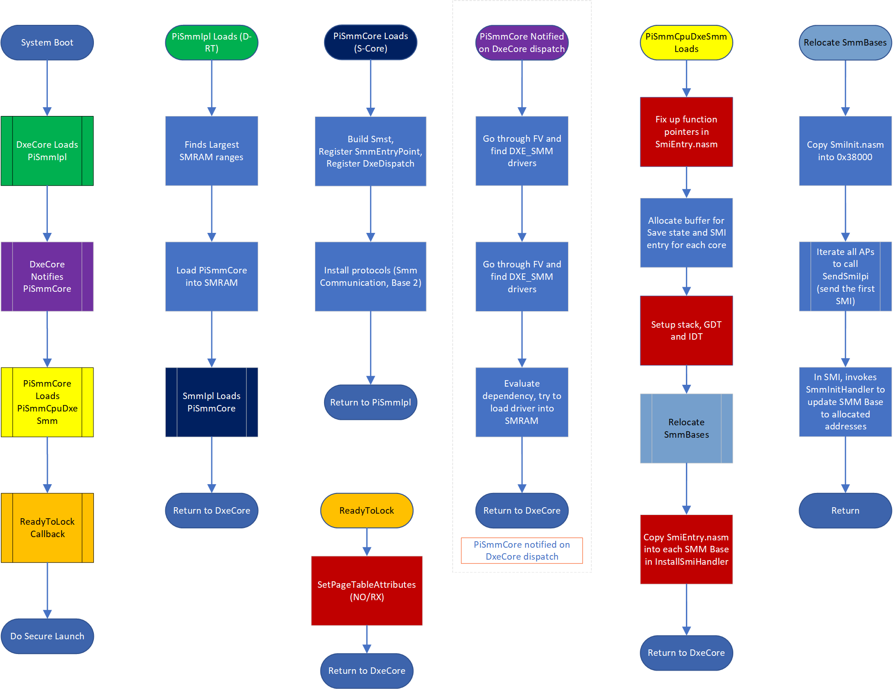
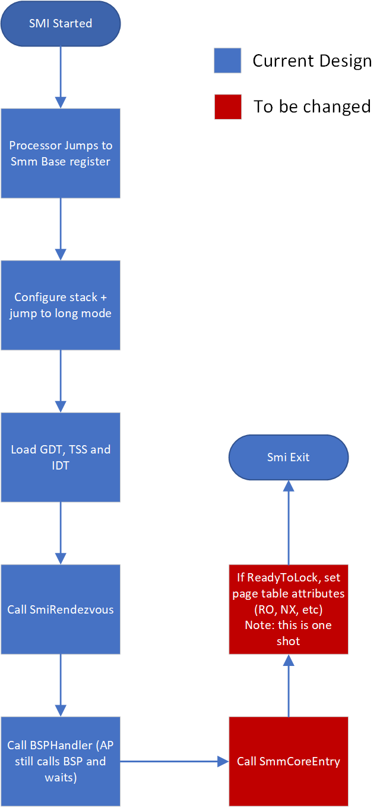

# Traditional MM Framework Implementation for Reference

This section provides a high-level overview of the Traditional MM framework and key components.

Traditional MM is not supported by the code in this repository and is discouraged for future development. The details
in this section are provided for reference only.

## Module Overview

Four main modules compose the SMM framework (all in the post-PEI boot phase):

- **[PiSmmIpl](https://github.com/microsoft/mu_basecore/blob/HEAD/MdeModulePkg/Core/PiSmmCore/PiSmmIpl.inf)** -
  Searches for available MMRAM regions and loads `PiSmmCore`.
- **[PiSmmCore](https://github.com/microsoft/mu_basecore/blob/HEAD/MdeModulePkg/Core/PiSmmCore/PiSmmCore.inf)** -
  Loads MM handler drivers during boot, provides memory allocation and free services, manages the protocol and MM
  handler database, provides protocol and/or event notification services, and dispatches registered MM handlers
  registered by MM drivers.
- **[PiSmmCpuDxeSmm](https://github.com/microsoft/mu_basecore/blob/HEAD/UefiCpuPkg/PiSmmCpuDxeSmm/PiSmmCpuDxeSmm.inf)** -
  Relocates the MM base address, configures MMI entry code, sets up GDT, IDT, page table protections.
- **MM Drivers** - Drivers usually authored by the OEM for highly privileged jobs, such as power management. These
  drivers will register handlers via `PiSmmCore` services that will be invoked upon MMI events.

## Boot Flow Overview

The Traditional MM framework boot flow is illustrated above.

*The color of each subprocess activation block matches the first block in the corresponding flow*.

1. During system boot, **PiSmmIpl** will be loaded by DXE core. This driver will:
    - Open and find the largest available MMRAM range
    - Copy **PiSmmCore** into MMRAM and load it.
      - 🗒️**NOTE** that MMI entry is not setup yet, thus the **PiSmmCore** entrypoint is not executed in a MM environment.
    - Share certain private data with **PiSmmCore** (`mSmmCorePrivateData`).
2. At the entrypoint of **PiSmmCore**:
    - **PiSmmCore** provides `gSmst`, a global table of service consumable from MM handler drivers, including functionality
      for memory allocation, protocol publication, handler registration and waking up APs.
    - **PiSmmCore** registers required MMI handlers to itself, including `gEfiEventDxeDispatchGuid`, which is signaled on
      every round of DXE dispatching. MM handler drivers are dispatched from this internal MMI handler, publishing protocols
      and signalling events consumable by other DXE and Traditional MM drivers.
3. During MM handler driver dispatch, **PiSmmCpuDxeSmm** will be loaded to set up MMBASE and MMI entry. At the entrypoint
   of **PiSmmCpuDxeSmm**:
    - A buffer is allocated for SMM save state and MMI entry as described in the
      [Memory Protection in SMM](https://edk2-docs.gitbooks.io/a-tour-beyond-bios-memory-protection-in-uefi-bios/memory-protection-in-SMM.html)
      book.
    - Stacks are allocated for the MMI environment.
    - The [GDT](https://github.com/microsoft/mu_basecore/blob/HEAD/UefiCpuPkg/PiSmmCpuDxeSmm/X64/SmiException.nasm)
      is set up for code segment management and the IDT for exception handling.
    - [Relocate MMBASE](https://github.com/microsoft/mu_basecore/blob/7fb35514b511dc68b0bf4e69de54c0162dbd0536/UefiCpuPkg/PiSmmCpuDxeSmm/PiSmmCpuDxeSmm.c#L431)
      is allocated for the [`SmiEntry` code block](https://github.com/microsoft/mu_basecore/blob/HEAD/UefiCpuPkg/PiSmmCpuDxeSmm/X64/SmiEntry.nasm).

## Interupt Flow

1. Upon a MMI, the CPU will pause executing software and start execution from the MM base address, which was relocated by
   **PiSmmCpuDxeSmm**. At initial entry point, system will start from legacy (16-bit) mode.

2. MMI entry code block is responsible to bring the system up to 64-bit mode before handing over to `SmiRendezvous`,
   a routine to synchronize all cores on a processor inside **PiSmmCpuDxeSmm**. This process includes stack initialization,
   configure IDT, GDT and TSS to the ones initialized in **PiSmmCpuDxeSmm** entry point.

3. SmiRendezvous will put all APs stand by for multi-processor job, and release BSP to SMM framework routine `SmmCoreEntry`,
   which will manage **PiSmmCore** SMI private data and dispatch all handlers registered by other SMM handler drivers.

4. If this MMI happens immediately after `gEfiDxeSmmReadyToLockProtocolGuid` event, the system will apply page table
   attributes and prevent further paging modification from this point and on.
