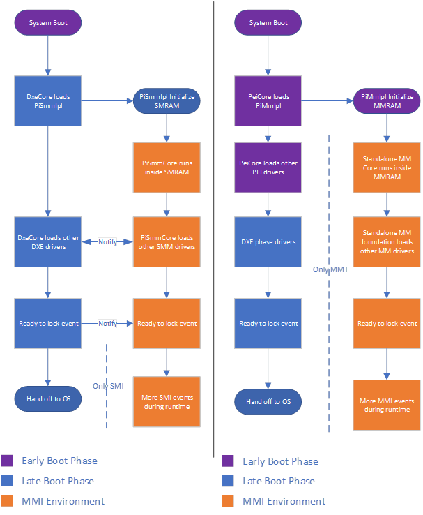

# Standalone MM

This document summarizes some of the benefits gained by adopting Standalone MM versus Traditional MM.

For general background on Management Mode (MM), review the Platform Initialization (PI) specifications. In particular,
Volume 4: Management Mode Core Interface. As noted in the PI specification, MM is a generic term used to describe a secure
execution environment provided by the CPU and related silicon that is entered when the CPU detects a Management Mode
Interrupt (MMI). x86 systems implement MM with System Management Mode (SMM) and ARM systems do so with TrustZone (TZ).
This document exclusively focuses on the x86 architecture.

Two MM "modes" are defined in the PI specification – (1) Traditional MM and (2) Standalone MM. Traditional MM is equivalent
to the SMM software model historically used in PI-compliant firmware. Standalone MM is a relatively new mode that revises
the historical model to improve security of the MM environment and prevent common mistakes made in Traditional MM
implementations that led to numerous portability and security challenges over the years.

A detailed comparison of the Traditional MM and Standalone MM load process is described in the PI Specification sections
"Initializing Management Mode in MM Traditional Mode" and "Initializing Management Mode in Standalone Mode" respectively.

It should be noted that both modes leverage the same hardware capabilities. No special hardware is required to transition
a firmware to Standalone MM. Further, nearly all existing SMM code can be reused in Standalone MM with no change. Most
mandatory changes either involve minimally changing small portions of code such as an entry point function signature or
the module type or making changes that are not allowed in Standalone MM because they were violating security practices in
Traditional MM. For example, compare the "MM Traditional Driver Runtime" section of the PI Specification with the "MM
Standalone Driver Runtime" section.

Instances of code in silicon code today violates the "soft restrictions" described in the traditional section.

## Traditional MM Versus Standalone MM

This section compares the main differences between Traditional MM and Standalone MM.

### MM Driver Initialization and Runtime Phases

Traditional MM typically launched in DXE and the DXE and Traditional MM environments closely interacted throughout driver
dispatch. During MM dispatch, drivers execute in two phases – (1) initialization and (2) runtime.

|  | Traditional MM Initialization | Standalone MM Initialization |
| --- | --- | ---|
| Starts | When the driver is loaded into MMRAM and the driver’s entry point is called | When the driver is loaded into MMRAM and the driver’s entry point is called |
| Ends | The driver’s entry point returns | The driver’s entry point returns |
| Protocol Access | UEFI  - Boot services - DXE services - Runtime services - DXE protocols MM - MM Services - MM protocols  Note: The PI specification states drivers should not call Exit() or ExitBootServices() during the initialization phase | MM - MM Services - MM protocols   Note: Drivers do not have access to interfaces outside the MM environment. |

|  | Traditional MM Runtime | Standalone MM Runtime |
| --- | --- | ---|
| Starts | After the initialization phase ends | Starts after the initialization phase ends |
| Protocol Access | MM - MM Services - MM protocols  Note: The PI specification states drivers should not call UEFI interfaces and services which were located during the initialization phase. | MM - MM Services - MM protocols  Note: Drivers do not have access to interfaces outside the MM environment. |

Given the initialization phase in Traditional MM occurred in DXE, in addition to the `DXE_SMM_DRIVER` driver type, `EFI_FV_FILETYPE_COMBINED_MM_DXE`
driver types are also supported. Combination MM/DXE drivers are especially problematic for writing portable and secure
code. They are launched twice, once by the DXE dispatcher as a normal DXE driver (outside MMRAM) that uses the `EFI_SECTION_DXE_DEPEX`
section and again in Traditional MM (in MMRAM) where the `EFI_SECTION_MM_DEPEX` is used. In contrast, `MM_STANDALONE` drivers
are launched once is Standalone MM only with access to the MM services and protocols.

### Traditional MM and Standalone MM Dispatch Overview

Because the Standalone MM environment inherently has less coupling with DXE, it is much easier to launch Standalone MM
code earlier in the boot flow which contributes to reducing the overall TCB. In addition, MM drivers cannot depend on
implementation specific DXE protocols and interfaces increasing their portability. For example, this can force MM code
design to be more reusable across silicon generations and client and server codebases.

## Problems with Traditional MM

Standalone MM can largely be considered a more disciplined approach to software execution in SMM. This discipline contributes
to reduced likelihood of security issues, increased portability, and more flexibility in how to launch the MM environment.
For a silicon vendor such as Intel and AMD, all of this improves the ability of partners to better integrate silicon
reference code into their designs.

Some key issues with Traditional MM are noted below.

1. **Late launch** – Launching in DXE means another execution environment must be trusted after PEI to establish the MM environment.
1. **Excessive DXE coupling** – Traditional MM is architecturally dependent on DXE.
    - MM driver writers often make mistakes and cache interface pointers not allowed in the initialization phase. This is
    a frequent source of security issues.
    - MM drivers are dependent on DXE interfaces in their initialization phase. This makes it more difficult to execute
    these drivers in an environment where DXE is not present.
    - Much as MM drivers have dependencies on the load order of the DXE environment, DXE drivers do on MM drivers.
        - For example, many DXE drivers have a dependency on the UEFI variable architectural protocol and/or the UEFI variable
        write architectural protocol. When MM is launched earlier in boot, such as PEI, the MM environment is already set
        up and ready making DXE dispatch more reliable.
1. **Delayed MM locking** – Some system locks are delayed longer than necessary because the MM initialization phase is open
throughout all of DXE.
1. **Broad memory access** – Traditionally, SMM can access any memory buffer allocated prior to SmmReadyToLock. This presents
security issues in which a freed buffer can be reassigned after the lock event and much more memory is exposed than necessary.
    - It is recommended to use Standalone MM in combination with explicit memory ranges to be unblocked for MM access.
    The [MmUnblockMemoryLib](https://github.com/tianocore/edk2/blob/master/MdePkg/Include/Library/MmUnblockMemoryLib.h)
    API provides a mechanism for callers outside MM to permit explicit ranges to be accessible.

Launching the MM Foundation earlier brings other benefits such as the ability to use the read/write variable service in
MM while in PEI. Because DXE is not involved, the MM Foundation can be entirely loaded and operational before launching
payloads after PEI other than DXE.

## Alignment With Silicon Partner Initiatives

Standalone MM launch in PEI naturally aligns with other silicon partner planned work such as:

- 64-bit PEI – Thunking is not necessary between a 32-bit PEI and 64-bit MM environment.

## Enabling Options

Standalone MM provides flexibility in how to enable it. For example, if desired, a platform can simultaneously support
both Traditional MM and Standalone MM modes with a build switch.

### Launch Phase

Standalone MM can be launched in PEI which is preferred but it can also be launched in DXE at a similar point in the boot
flow to Traditional MM to minimize deviation between the initialization point of the two modes.

A high-level proposed Standalone MM IPL process in PEI is described below.

1. Dispatch the Standalone MM PEI IPL in post-memory PEI.
1. In the entry point of the Standalone MM PEI IPL, verify system pre-requisites are satisfied to set up the MM foundation
in MMRAM.
    - Example: the MM Control PPI and MM Access PPI are installed and sufficiently large MMRAM regions are reported.
    - Because in Standalone MM, the platform cannot provide information via DXE interfaces, it is expected a platform will
    have to provide data in HOBs that must be present when the Standalone MM PEI IPL is executed.
        - In general, this is considered a more ordered and structured approach to providing data into MM.
1. Check if the system PEI is 32-bit. If so, cache the system execution context and then switch to X64 mode to load a X64
relay module (similar to CapsuleX64.inf).
    - The X64 relay module can execute the Standalone MM core entry point with a supplied HOB start address.
1. During the Standalone MM Foundation initialization, all Standalone MM drivers are loaded into MMRAM. No further drivers
will be loaded from outside MMRAM during the boot.
    - To better organize this process and focus relevant module exposure to the corresponding dispatchers, all Standalone
    MM drivers can be consolidated in a single firmware volume.
1. After the Standalone MM Core Foundation is setup, the system will return to 32-bit mode restoring the cached context
information, if applicable, and closing and locking all MMRAM regions.
1. The Standalone MM PEI IPL installs the MM Communication PPI for PEIM usage in the remainder of the PEI phase.
1. Once DXE is launched, the DXE MM Communication Protocol will be installed for DXE drivers to communicate with Standalone
MM drivers.

### MM Module Dual Mode Support

All Traditional MM modules can continue to be supported with most of the code shared between the Traditional MM and Standalone
MM instances.

Typically, modules end up in the following state:

- A Traditional MM INF file
- A Standalone MM INF file
- A Common MM C file – where the actual module implementation is written
- A Traditional MM C file – usually with just the Traditional MM entry point function that calls into the common C code
- A Standalone MM C file – usually with just the Standalone MM entry point function that calls into the common C code

Therefore, the Traditional MM module is not lost, and its implementation can simultaneously stay current with the Standalone
MM driver.

Even for a driver as complex as the UEFI variable driver, this pattern reveals the small touch necessary to support
Standalone MM:

- INF files
  - Traditional MM: [edk2/VariableSmm.inf at master · tianocore/edk2 (github.com)](https://github.com/tianocore/edk2/blob/master/MdeModulePkg/Universal/Variable/RuntimeDxe/VariableSmm.inf)
  - Standalone MM: [edk2/VariableStandaloneMm.inf at master · tianocore/edk2 (github.com)](https://github.com/tianocore/edk2/blob/master/MdeModulePkg/Universal/Variable/RuntimeDxe/VariableStandaloneMm.inf)
- C entry point files
  - Traditional MM: [edk2/VariableStandaloneMm.c at master · tianocore/edk2 (github.com)](https://github.com/tianocore/edk2/blob/master/MdeModulePkg/Universal/Variable/RuntimeDxe/VariableStandaloneMm.c)
  - Standalone MM: [edk2/VariableTraditionalMm.c at master · tianocore/edk2 (github.com)](https://github.com/tianocore/edk2/blob/master/MdeModulePkg/Universal/Variable/RuntimeDxe/VariableTraditionalMm.c)

## Common Steps to Port Traditional MM to Standalone MM

- Change the driver entry point prototype from the Traditional MM API to the Standalone MM API.
  - The driver will now use StandaloneMmDriverEntryPoint.
  - The system table should be of type "EFI_MM_SYSTEM_TABLE".
- In target INF files, use "MM_STANDALONE" as "MODULE_TYPE".
- In target INF files, set "PI_SPECIFICATION" version to "0x00010032".
- Update any "DXE_SMM_DRIVER" libraries that will now be ported for the Standalone MM environment, add support for the
"MM_STANDALONE" and "MM_CORE_STANDALONE" driver types.
- To minimize impact on packages like ClientOneSiliconPkg that are used by many different products, the file paths to the
pre-existing module INF file remain unchanged. For example, PchSmiDispatcher is still called PchSmiDispatcher. However,
in many cases, a new Standalone MM INF file accompanies the original SMM driver INF that has minor differences such as specifying
the MODULE_TYPE as MM_STANDALONE and using a different module entry point API. In cases where backward compatibility is
not a concern, such as a .C source file name (as opposed to the INF file name), it is generally preferred to update terminology
to "traditional MM".
- Use MemoryAllocationLib functions to allocate and free memory as opposed to gSmst or gMmst directly. This can improve
portability between the two services tables.
- Find an alternative solution for gBS, gDS, and other DXE environment accesses.
- Find an alternative solution for any PCDs that are not FixedAtBuild. The PCD protocol is not available within the Standalone
MM environment.
- Check MM driver DEPEX statements and dispatch order after removing DXE protocols to ensure dispatch requirements are
still met.

## Standalone MM at Microsoft

Microsoft has already implemented a POC on Tiger Lake that enables Standalone MM. We plan to ship code based on this Standalone
MM implementation for Tiger Lake based products. It would greatly help reduce engineering effort within Microsoft if silicon
partners would update silicon reference code to include Standalone MM support.

*Note:* A Traditional MM option would be unnecessary for Microsoft if Standalone MM is fully supported.
