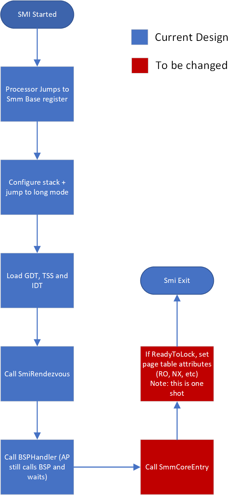

# Traditional SMM framework implementation (**not Secured Core compliant**)

## SMM framework modules

4 main modules consist of SMM framework (all in post-PEI phase):

- **[PiSmmIpl](https://github.com/microsoft/mu_basecore/blob/release/202005/MdeModulePkg/Core/PiSmmCore/PiSmmIpl.inf)**
will search for available SMRAM regions and load PiSmmCore.
- **[PiSmmCore](https://github.com/microsoft/mu_basecore/blob/release/202005/MdeModulePkg/Core/PiSmmCore/PiSmmCore.inf)**
will load SMM handler drivers during boot, provide memory allocation and free service, manage protocol and SMM handler database,
provide protocol and/or event notification services, and dispatch registered SMM handles from SMM Handler drivers
- **[PiSmmCpuDxeSmm](https://github.com/microsoft/mu_basecore/blob/release/202005/UefiCpuPkg/PiSmmCpuDxeSmm/PiSmmCpuDxeSmm.inf)**
will relocate SMM base address, configure SMI entry code, set up GDT, IDT, page table protection.
- **Smm Handler drivers**, the drivers OEM authored for highly privileged jobs, such as power management. These drivers
will register handlers through PiSmmCore services and get dispatched during SMI events.

## SMM framework boot flow


SMM framework boot flow is illustrated above. (The color of each subprocess activation block matches the first block in
the corresponding flow)

1. During the system boot, **PiSmmIpl** will be loaded by DXE core. This driver will:
    - Open and find the largest available SMRAM range
    - Copy **PiSmmCore** into SMRAM and load it from SMRAM. *NOTE* that SMI entry is not setup yet, thus **PiSmmCore**
    entrypoint is not executed in SMI environment
    - Share certain private data with **PiSmmCore** (mSmmCorePrivateData).
1. At the entrypoint of **PiSmmCore**:
    - **PiSmmCore** provides gSmst, a global table of service consumable from SMM handler drivers, including memory allocation,
    protocol publication, handler registration and waking up APs
    - **PiSmmCore** register required SMI handler to itself, including gEfiEventDxeDispatchGuid, which is signaled on
    every round of DXE dispatching. SMM handler drivers are dispatched from this internal SMI handler, publishing protocols
    and signalling events consumable by other DXE and SMM drivers.
1. During the SMM handler driver dispatch, **PiSmmCpuDxeSmm** will be loaded to set up SMBASE and SMI entry. At the entrypoint
of **PiSmmCpuDxeSmm**
    - Allocate buffer for SMM save state and SMI entry as described in [git book by EDK2](https://edk2-docs.gitbooks.io/a-tour-beyond-bios-memory-protection-in-uefi-bios/memory-protection-in-SMM.html)
    - Allocate stacks for SMI environment
    - Setup [GDT](https://github.com/microsoft/mu_basecore/blob/release/202005/UefiCpuPkg/PiSmmCpuDxeSmm/X64/SmiException.nasm)
    for code segment management and IDT for exception handling
    - [Relocate SMBASE](https://github.com/microsoft/mu_basecore/blob/7fb35514b511dc68b0bf4e69de54c0162dbd0536/UefiCpuPkg/PiSmmCpuDxeSmm/PiSmmCpuDxeSmm.c#L431)
    to allocated [SmiEntry code block](https://github.com/microsoft/mu_basecore/blob/release/202005/UefiCpuPkg/PiSmmCpuDxeSmm/X64/SmiEntry.nasm)

## SMI interrupt flow



1. Upon a SMI input, CPU will pause currently running software and start from SMM base address, which was relocated by
**PiSmmCpuDxeSmm**. At initial entry point, system will start from legacy (16-bit) mode.
1. SMI entry code block is responsible to bring the system up to 64-bit mode before handing over to ```SmiRendezvous```,
a routine to synchronize all cores on a processor inside **PiSmmCpuDxeSmm**. This process includes stack initialization,
configure IDT, GDT and TSS to the ones initialized in **PiSmmCpuDxeSmm** entry point.
1. SmiRendezvous will put all APs stand by for multi-processor job, and release BSP to SMM framework routine ```SmmCoreEntry```,
which will manage **PiSmmCore** SMI private data and dispatch all handlers registered by other SMM handler drivers.
1. If this SMI happens immediately after gEfiDxeSmmReadyToLockProtocolGuid event, the system will apply page table
attributes and prevent further paging modification from this point and on.
