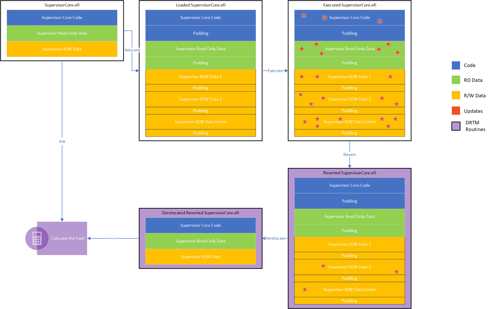
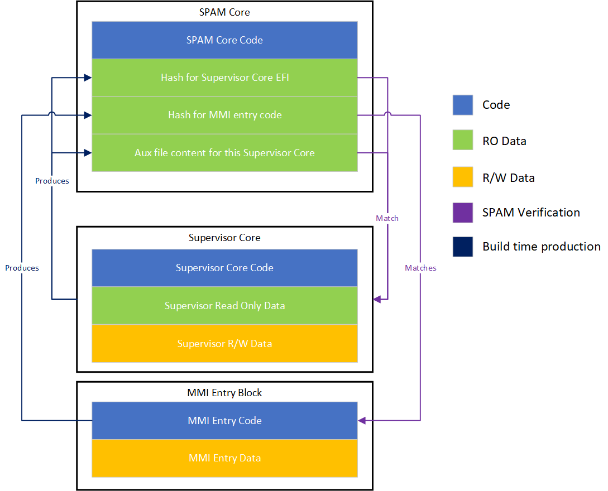

# SMM Enhanced Attestation (SEA) Platform Integration

The SEA source code is intended to be used as-is by platforms. In order to integrate the SEA core and MM Supervisor into
a platform firmware it is important to consider higher-level integration challenges specific to the platform in addition
to the required code changes to integrate all of the pieces.

## High-Level Considerations

1. [MM Supervisor Changes](#mm-supervisor-changes) - Source code in the MM Supervisor repo is responsible for
   loading SEA core into the MSEG region. The MM Supervisor is responsible for protecting MM assets before SEA is loaded.

1. [Executed Supervisor Validation](#executed-supervisor-validation) - The SEA core is responsible for inspecting the MM
   Supervisor environment and validating the MM Supervisor code and data.

1. [Platform Data Requirements](#platform-data-requirements) - The MM Supervisor requires that a new set of industry
   standard defined data structures in addition to supervisor-specific data structures be produced by the platform.

1. [SEA Code Integration](#sea-code-integration) - How to best integrate the `SEA core` collateral into a platform
   firmware.

## MM Supervisor Changes

Begin by reading the [MM Supervisor documentation](../../../MmSupervisorPkg/Docs/MmSupervisorDesign.md) and the
[SEA Overview](Overview.md) to gain a basic understanding of the Standalone MM operating mode and the MM Supervisor
feature.

SEA is responsible for validating the entire flow of the Memory Management Interrupt (MMI), which begins in the MMI
entrypoint, continues through execution in the MM Supervisor, and finally ends with the `rsm` instruction to return
from SMM. This requires the MM entrypoint code to be decoupled from the MM Supervisor, and the new MMI entrypoint code
is auditable with respect to the jump point into the MM Supervisor.

Hence, a new [MMI entrypoint](../../MmiEntrySea/MmiEntrySea.inf) is created to allow the MM Supervisor to load using MM
relocation phase. It is also crafted so that the jump point into the MM Supervisor is located at the end of the MMI
entrypoint code. This allows the SEA to validate the entire flow of the MMI.

Thus, a new [SmmCpuFeaturesLib](../../Library/SmmCpuFeaturesLib/StandaloneMmCpuFeaturesLibStm.inf)
is created to provide the necessary CPU features for the MM Supervisor to load the SEA core.

Specifically, the library, linked to the MM Supervisor, will locate the resources needed, load the SEA core into MSEG,
load the MMI entrypoint code blob to `MM_BASE` for each core, fix up the jump points based on MM Supervisor function
pointers, and finally protect the loaded images.

## Executed Supervisor Validation

The SEA core is responsible for verifying the entire environment of the MM Supervisor. When the D-RTM event occurs, the
system has already booted into the OS, and the MM Supervisor is already loaded and executed. Thus the validation routine
from SEA needs to inspect the data, code and the environment of the MM Supervisor.



__SEA Core Steps__:

As illustrated above, to accomplish this, the SEA core will perform the following steps:

1. Validate the provided digest list for the MMI entries and Supervisor core.
1. Confirm that the MM Entry code is inside MMRAM.
1. Validate the AUX file (ensure it is present, inside MMRAM, and has a valid header signature).
1. Validate the KEY symbols from the AUX file.
1. Create the fixup data and copy the MMI entry into it.
1. Revert regions in the fixup MMI entry (zero it).
1. Validate the MMI Entry through hashing.
1. Retrieve current MM CORE information with MM rendezvous.
1. Verify that the current image is inside MMRAM.
1. Verify that the GDTR is inside MMRAM.
1. Verify that CR3 points to the same page table from the symbol list in the AUX file.
1. Verify that CR3 is inside MMRAM.
1. Verify that the supervisor stack is inside MMRAM.
1. Verify that MM Debug Entry and Exit are inside MMRAM.
1. Verify that IDTR is inside the MM CORE region.
1. Verify that the firmware policy is inside MMRAM.
1. Verify the MM Core code hash.
1. Report the Policy code.

The complex validation and reversion process occurs with the function `VerifyAndHashImage()` for the MM Core in the
step "Verify the MM Core code hash."

__`VerifyAndHashImage()` Flow__:

The `VerifyAndHashImage()` function follows this flow:

1. Verify that the image is in MMRAM.
1. Copy the image over to MSEG and retrieve the image information.
1. Create a buffer to copy the image into and then validate the differences found based on the AUX file.
    - Everything labeled as a "rule" is validated based on the type of rule, and then the contents of the original
      binary are copied over to maintain coherency for the hash validation.
1. Revert the loaded image and place it into a newly created buffer.
1. Hash the reverted image and compare it to the original hash of the supervisor binary.
1. Reversion Process:

The behavior of the reversion code is somewhat complex and relies on reported image sections. This leads to different
behavior between the `DEBUG` and `RELEASE` builds.

__Reversion Flow__:

1. Validate section alignment.
1. Read the PE/COFF header into memory and read the first section, which provides the number of sections.
   - Loop through each section of the image, copying over the sections if they have a `SizeOfRawData` > 0.
1. The behavior differs between the `DEBUG` and `RELEASE` builds, as highlighted below.
1. Load the Codeview information if present.
1. Ensure the size of the image is correctly aligned.

All these steps are done with the guidance of platform validation rules. For more information on the validation rules,
refer to the [SEA Validation Rules](#sea-validation-rules) section.

## Platform Data Requirements

The platform needs to produce the data structures in this section. The structures are consumed by MM Supervisor code to
allow the `SmmCpuFeaturesLib` to acquire platform-specific details.

### HOBs Required by `SmmCpuFeaturesLib`

1. `gMsegSmramGuid` - MSEG memory region information.
   - [UefiCpuPkg/Include/Guid/MsegSmram.h](https://github.com/tianocore/edk2/blob/master/UefiCpuPkg/Include/Guid/MsegSmram.h)
   - Note that [`MsegSmramPei`](../../Drivers/MsegSmramPei/MsegSmramPei.inf) can be used to help produce this HOB.

### SEA Validation Rules

The "SEA Validation Rules" are a data structure used to guide the SEA core to validate certain data regions of MM
Supervisor core. The validation rules are fixed for a given SEA binary build and will be compiled into SEA core binary.
The rules are used during boot to validate the state of the MM Supervisor and revert the content of the MM supervisor
before SEA attempts to de-relocate the MM Supervisor for signature validation.

As defined in this [header file](../../Include/SeaAuxiliary.h), the SEA core will use the following rules to validate the
MM memory regions:

1. `IMAGE_VALIDATION_ENTRY_TYPE_NONE`: Ignore the region corresponding to this entry.
1. `IMAGE_VALIDATION_ENTRY_TYPE_MSEG`: The region is MSEG, SEA core will validate the region to be MSEG.
1. `IMAGE_VALIDATION_ENTRY_TYPE_CONTENT`: The content inside this region matches exactly the content inside the rule.
1. `IMAGE_VALIDATION_ENTRY_TYPE_MEM_ATTR`: The memory attribute of the region matches the rule.
1. `IMAGE_VALIDATION_ENTRY_TYPE_SELF_REF`: The region is self-referenced, SEA core will validate the region to be pointing
to another point inside the MM Supervisor.
1. `IMAGE_VALIDATION_ENTRY_TYPE_POINTER`: The entry is a pointer to and the pointer needs to be not null, pointing to non
MSEG, or pointing to outside of TSEG, depending on the rule.

The syntax of the rules is as described in this [documentation](../../Tools/GenSeaArtifacts/gen_aux/readme.md).

## SEA Code Integration

A general description of SEA and MM Supervisor code integration is depicted below:



1. Ensure all submodules for the platform are based on the latest Project Mu version (e.g. "202502")
1. Include this repo as a submodule for your platform repos and set the folder path as `Common/MU_MM_SUPV`
(also add `Common/MU_MM_SUPV` to required repos and module packages in the platform build script):
<https://windowspartners.visualstudio.com/MsCoreUefi_Thanos/_git/msft_mmsupervisor>

> Note: A list of the libraries and modules made available by this package is provided in the
  [Software Component Overview](SoftwareComponentOverview.md).

### Build Flow

Building a platform that integrates the SEA core and and MM supervisor is a multi-stage process as the MmSupervisorCore
must be built before the STM (and optionally the rest of the platform). This is due to the fact that the STM consumes
artifacts (as PCDs) that are generated based off the compiled MM supervisor core. Specifically the Aux File mentioned
above, which is a parsable binary file holding rules to validate the contents of the MM Supervisor. The flow looks like
this:

1. Build MmSupervisorCore.efi, MMiEntrySea.bin (EDKII build part 1)
2. Generate MmSupervisorCore.aux, MmArtifacts.dsc.inc (Custom tooling, provided)
3. Build Stm.bin (EDKII build part 2)
4. Build the rest of the platform (EDKII part 3, optionally combined with EDKII build part 2)

Depending on your implementation method (1), (2), and (3) will be handled by an external entity and the following
binaries will be provided to your platform:

- MmiEntrySea.bin
- MmSupervisorCore.efi
- Stm.bin

In this scenario, you simply need to add the fdf statements as mentioned in, [Platform FDF Statements](#platform-fdf-statements),
however you should link against the provided binaries rather than the output directory binaries as mentioned above.

#### Building MmSupervisorCore, MMiEntrySea and STM manually

Should your platform decide to build these three binaries itself, then the following actions must be taken prior to
running the final platform build. As noted, custom tooling is provided for step (2) which requires rust to be available
on your system.

1. The first step is to build the MmSupervisorCore.efi and MMiEntrySea.bin from MmSupervisorPkg and SeaPkg
respectively. This process is no different then a normal EDKII build.

2. Generating the MmSupervisorCore.aux and MmArtifacts.dsc.inc is a slightly more complicated process. We provide
multiple levels of abstraction for generating these files depending on your needs, which will be described below, and
are ordered from the highest level of abstraction to the lowest.

- If your platform uses Stuart to build, then the necessary function is automatically imported and is available
  available via `self.Helper.gen_sea_includes(...)`. The function documentation can be found at `SeaPkg/Tools/GenSeaArtifacts/GenSeaArtifacts.py`.
  
- If your platform does not use stuart, but has a python script, you can still use this function, but you must
  manually import the module, and use it via `GenSeaArtifacts.gen_sea_includes(...)`.
  
- If your platform has completely custom tooling, then you will need to follow the same flow as `gen_sea_includes`
  manually, which includes calling `cargo run gen_aux` (`SeaPkg/Tools/gen_aux/readme.md`) and `py BinToPcd.py`
  (`BaseTools`).

The final step is to build the Stm.bin, which consumes the auxiliary file and a few other pieces of information via
PCDs as denoted in the `gen_sea_includes(...)` python function and described in [Platform DSC statements](#platform-dsc-statements).

In all scenarios for (2), you will need to review the `gen_aux` tool to see how to properly generate the configuration
file, for gen_aux, which in turn is used to generate the auxiliary file. The auxiliary file is compiled into the STM
and used to validate the execution of the MmSupervisorCore as explained in [SEA Validation Rules](#sea-code-integration).

#### Platform DSC statements

The changes below assume that the platform has already integrated the MM Supervisor.

1. Add the DSC sections below.

``` bash
[LibraryClasses]
  SecurePolicyLib|MmSupervisorPkg/Library/SecurePolicyLib/SecurePolicyLib.inf

[LibraryClasses.X64.MM_CORE_STANDALONE]
  SmmCpuFeaturesLib|SeaPkg/Library/SmmCpuFeaturesLib/StandaloneMmCpuFeaturesLibStm.inf

[LibraryClasses.common.USER_DEFINED]
  StmLib|SeaPkg/Library/StmLib/StmLib.inf
  StmPlatformLib|SeaPkg/Library/StmPlatformLibNull/StmPlatformLibNull.inf
  SynchronizationLib|SeaPkg/Library/SimpleSynchronizationLib/SimpleSynchronizationLib.inf

[Components.IA32]
  SeaPkg/Drivers/MsegSmramPei/MsegSmramPei.inf

[Components.X64]
  SeaPkg/MmiEntrySea/MmiEntrySea.inf
```

Note that the supervisor needs to be built and passed through the `gen_aux` tool to output the `MmArtifacts.dsc.inc`
file, which is a the binary representation of the validation rules and the hash of the MM Supervisor and the MMI entry
code. The `MmArtifacts.dsc.inc` file is generated by the `GenSeaArtifacts.py` tool.

These values are then used to build the SEA core for final integration.

``` bash
[Components.X64]
  SeaPkg/Core/Stm.inf {
    <LibraryClasses>
      NULL|MdePkg/Library/StackCheckLib/StackCheckLibStaticInit.inf
      HashLibRaw|SeaPkg/Library/HashLibRaw/HashLibRaw.inf
      BaseCryptLib|CryptoPkg/Library/BaseCryptLibMbedTls/BaseCryptLib.inf
      MbedTlsLib|CryptoPkg/Library/MbedTlsLib/MbedTlsLib.inf
      IntrinsicLib|CryptoPkg/Library/IntrinsicLib/IntrinsicLib.inf
      PeCoffLibNegative|SeaPkg/Library/BasePeCoffLibNegative/BasePeCoffLibNegative.inf
      MemoryAllocationLib|MdeModulePkg/Library/BaseMemoryAllocationLibNull/BaseMemoryAllocationLibNull.inf
    <PcdsFixedAtBuild>
      !include $(OUTPUT_DIRECTORY)/$(TARGET)_$(TOOL_CHAIN_TAG)/MmArtifacts.dsc.inc
  }
  # Optionally, you can add the following test application to run the validation test
  # for the SEA core from shell.
  SeaPkg/Tests/ResponderValidationTest/ResponderValidationTestApp.inf {
    <PcdsFixedAtBuild>
      !include $(OUTPUT_DIRECTORY)/$(TARGET)_$(TOOL_CHAIN_TAG)/MmArtifacts.dsc.inc
  }
```

#### Platform FDF statements

1. Add the FDF sections below.

Note: There might be other silicon specific drivers a platform will need for these sections.

``` bash
[FV.YOUR_PEI_FV]
  INF SeaPkg/Drivers/MsegSmramPei/MsegSmramPei.inf

[FV.YOUR_POST_MEM_PEI_FV]
  FILE MM_CORE_STANDALONE=gMmSupervisorCoreGuid {
    SECTION PE32=$(OUTPUT_DIRECTORY)/$(TARGET)_$(TOOL_CHAIN_TAG)/X64/MmSupervisorCore.efi
    SECTION UI= "MmSupervisorCore"
  }
  FILE FREEFORM = gMmiEntrySeaFileGuid {
    SECTION RAW = $(OUTPUT_DIRECTORY)/$(TARGET)_$(TOOL_CHAIN_TAG)/X64/SeaPkg/MmiEntrySea/MmiEntrySea/OUTPUT/MmiEntrySea.bin
  }
  FILE FREEFORM = gSeaBinFileGuid {
    SECTION RAW = $(OUTPUT_DIRECTORY)/$(TARGET)_$(TOOL_CHAIN_TAG)/X64/SeaPkg/Core/Stm/DEBUG/Stm.bin
  }
```
